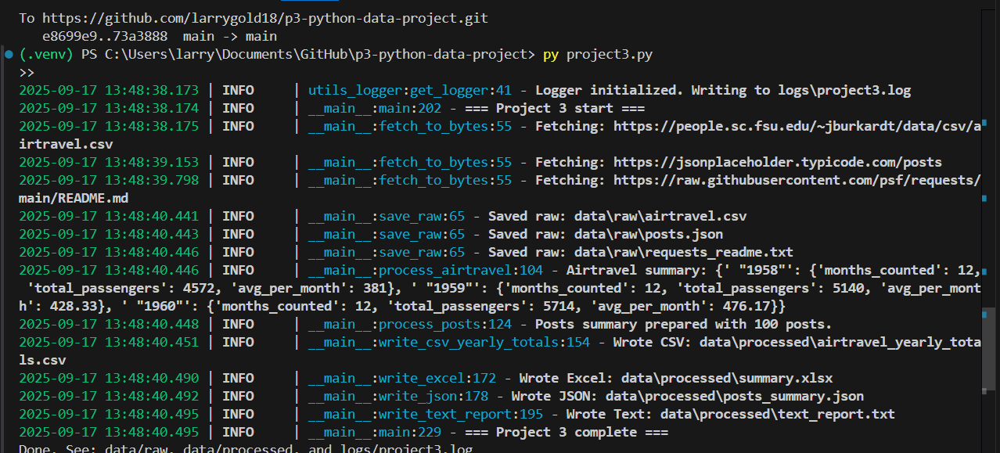

# Project 3 — Python Data Project (Windows 11)

This project fetches small datasets from the web, processes them with Python, and writes outputs (CSV, Excel, JSON, Text). Logging is handled by `utils_logger.py`.

---

## Prerequisites
- Windows 11
- Python 3.10+ and Git installed
- VS Code

---

## Setup (Windows PowerShell)

```powershell
# Create and activate a virtual environment
py -m venv .venv
.\.venv\Scripts\activate

# Upgrade base tools
py -m pip install --upgrade pip setuptools wheel

# Install dependencies (from this repo)
py -m pip install -r requirements.txt
---

## Run the Project

```powershell
py project3.py
---

## Screenshot (image.png)

A screenshot of my project running successfully in VS Code is included:  



---

## Git Workflow Cheat Sheet

```powershell
git add .
git commit -m "Meaningful message"
git push -u origin main
---

## Project Structure

```text
🗂 Project Structure
.
├── data/
│   ├── raw/                         # Original downloads
│   └── processed/                   # Outputs generated by project3.py
│       ├── airtravel_yearly_totals.csv
│       ├── summary.xlsx
│       ├── posts_summary.json
│       └── text_report.txt
├── logs/
│   └── project3.log                 # Run log
├── project3.py                      # Main script
├── utils_logger.py                  # Logging helper
├── requirements.txt                 # Dependencies
├── image.png                        # Screenshot of successful run
└── README.md                        # This file
```
